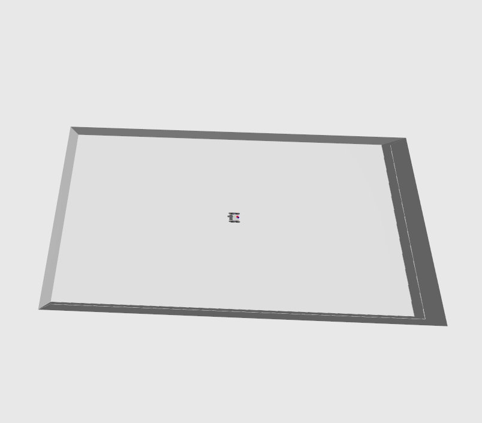
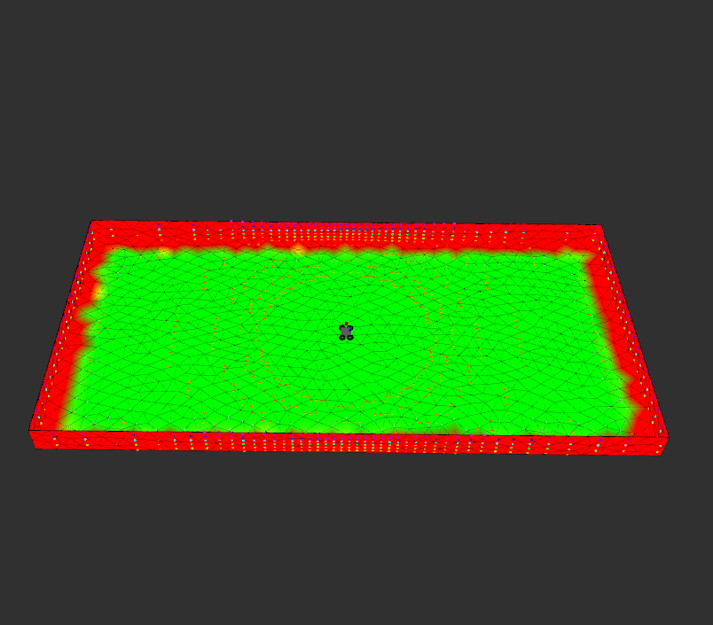
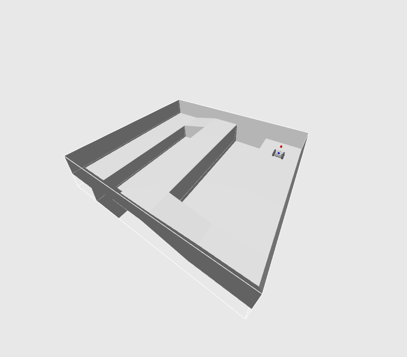
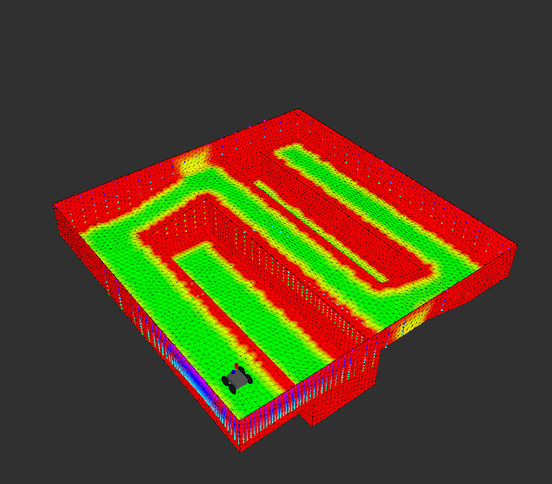
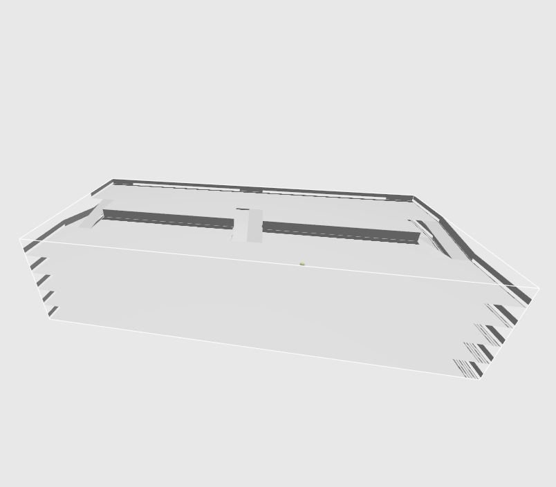
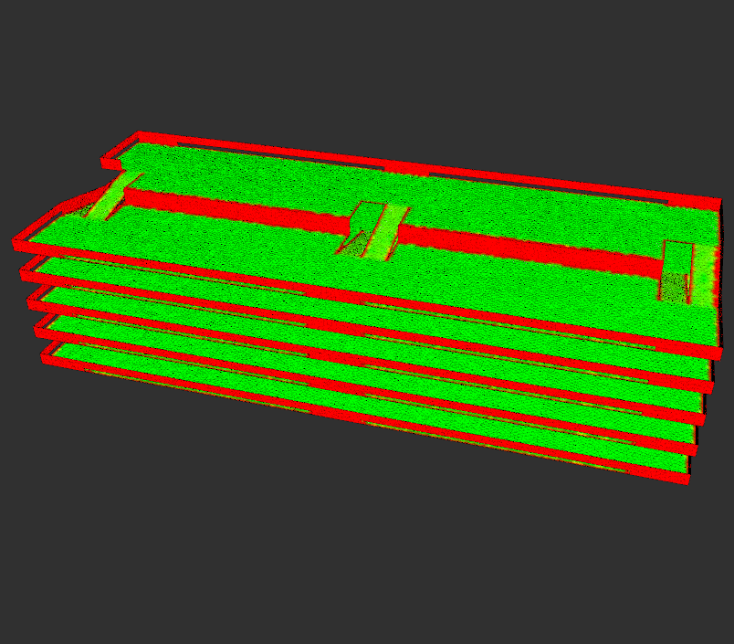

<div align="center">
<h1>
Mesh Navigation Tutorials
</h1>
</div>

<div align="center">
  <a href="https://github.com/naturerobots/mesh_navigation">Mesh Navigation</a>
  <span>&nbsp;&nbsp;•&nbsp;&nbsp;</span>
  <a href="https://github.com/naturerobots/mesh_navigation_tutorials/wiki">Documentation</a>
  <span>&nbsp;&nbsp;•&nbsp;&nbsp;</span>
  <a href="https://www.youtube.com/@nature-robots">Videos</a>
  <span>&nbsp;&nbsp;•&nbsp;&nbsp;</span>
  <a href="https://github.com/naturerobots/mesh_navigation_tutorials/issues">Issues</a>
  <br />
</div>


<br/>

This repository contains a set of examples to quickly and easily start with [mesh_navigation](https://github.com/naturerobots/mesh_navigation). 
We provide different scenarios where our approach excels over state-of-the art 2D or 2.5D approaches.
We will explain different parameter sets in more detail and show how to fine-tune [mesh_navigation](https://github.com/naturerobots/mesh_navigation) in various scenarios.
Our example worlds consists of both real-world and hand-modelled scenarios.
With the hand-modelled examples we particularly aim to support low-end computers or laptops.


*Note*: Because of an great interest of people we talked to, we decided to release this repository in an unfinished state. It is still under construction and will be extended by more synthetic and real-world recorded worlds and detailed docs. It's open-source: Feel free to contribute.  

## Requirements and Installation

* You need a working ROS 2 installation. We target `humble` at the moment.
* Go into a ROS 2 workspace's source directory `cd $YOUR_ROS_WS/src`.
* Clone the tutorial code `git clone git@github.com:naturerobots/mesh_navigation_tutorials.git`
* Get the tutorial's ROS 2 dependencies
  * Clone source dependencies: Run `vcs import --input mesh_navigation_tutorials/source_dependencies.yaml` in your ROS 2 workspace source directory.
  * Get packaged dependencies: Run `rosdep install --from-paths . --ignore-src -r -y` from within your ROS 2 workspace source directory.
* Build: Go to workspace root `cd $YOUR_ROS_WS` and run `colcon build --packages-up-to mesh_navigation_tutorials`.

## Run the Examples

### Launch
```console
ros2 launch mesh_navigation_tutorials mesh_navigation_tutorial_launch.py world_name:=floor_is_lava
```

You change `floor_is_lava` by any world name that is available with this repository (see all by calling launch file with `--show-args`). Those are: 

| Name | World | Default Map | Description |
|------|-------|-----|-------------|
| tray |  | | This world is a rectangular area with a wall around the perimeter. |
| floor_is_lava |  | | This world contains a square area with with two pits and a connecting section at a slightly higher elevation.
| parking_garage |  | | This world represents a parking garage with multiple floors connected by ramps. |

When running a simulated world, you can save some resources by not running the gazebo GUI: Add the `start_gazebo_gui:=False` launch argument.

### Rviz GUI
In rviz, you should be able to see the mesh map.
This map is being used for navigation.

In order to make the robot move, find the "Mesh Goal" tool at the top.
With it, you can click on any part of the mesh.
Click and hold to set a goal pose.
The MbfGoalActions rviz plugin contains a very tiny state machine that performs the following actions:
* subscribe to that goal pose
* get a path to that pose
* execute that path

## Detailed Instructions 

For more detailed instructions on how to parameterize things or what things can be changed see the [wiki](https://github.com/naturerobots/mesh_navigation_tutorials/wiki)


## Related Repositories
- [Move Base Flex](https://github.com/magazino/move_base_flex) ([IROS 2018](https://doi.org/10.1109/IROS.2018.8593829))
- [Mesh Tools](https://github.com/naturerobots/mesh_tools) ([RAS 2021](https://doi.org/10.1016/j.robot.2020.103688))
- [Mesh Navigation](https://github.com/naturerobots/mesh_navigation) ([ICRA 2021 paper for Continuous Vector Field Planner, CVP](https://doi.org/10.1109/ICRA48506.2021.9560981))
- [Rmagine](https://github.com/uos/rmagine) ([ICRA 2023](https://doi.org/10.1109/ICRA48891.2023.10161388))
- [MICP-L](https://github.com/uos/rmcl) ([IROS 2024](https://arxiv.org/abs/2210.13904))
- [RMCL](https://github.com/uos/rmcl)
